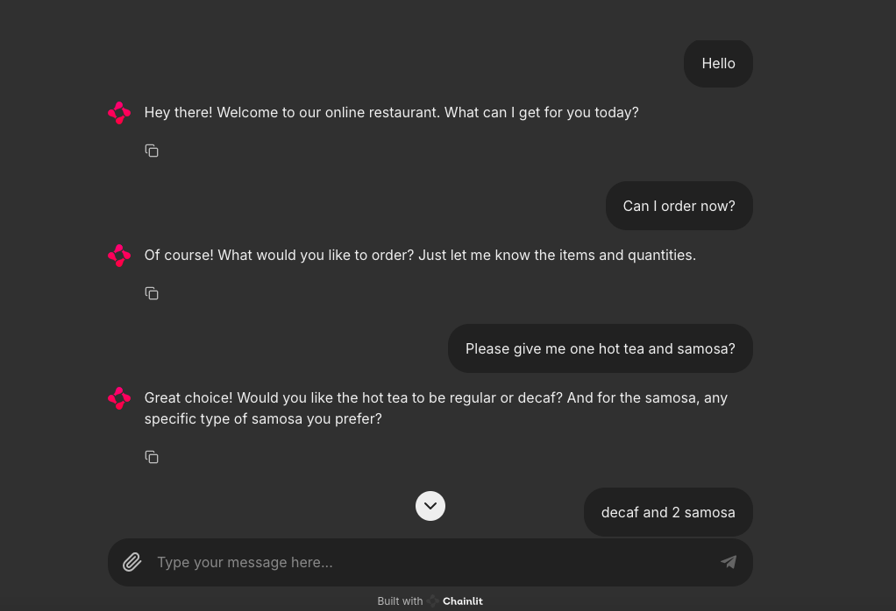

# Food-Delivery-Chatbot-using-Chainlit




## How to run?

1. Create a virtual environment

```bash
conda create -n chatbotChainlit python=3.10 -y

```

2. Activate the environment

```bash
conda activate chatbotChainlit

```


3. Install the required packages

```bash
pip install -r requirements.txt
```


## chainlit commands

```bash
chainlit init
```


```bash
chainlit run app.py
```
